# Tray Utility App

The main purpose of the app is saving your time, during the development, but first you need is write your utilities for it.  
The app includes some utilities like “Delete 'some' folder”, “Drop 'some' Database” etc.  
Maybe some of them needs to be configured first, but all the built-in utilities will be functionable.  

## Getting Started

First you need to connect your Visual Studio or VS Code or your usial working IDE, which supports version control, to the repository. Or 'Clone or download' -> 'Download ZIP' the repository to your PC and open it using your IDE.

### Prerequisites

This project was developing and still is developing on Visual Studio Professional. Visual Studio Community also lets you the same.

### Installing

1. Clone the repository in your IDE:  


2. Switch the build mode to 'Release mode' in the 'UtilitiesHandler' project:  


3. Rebuild the solution:  
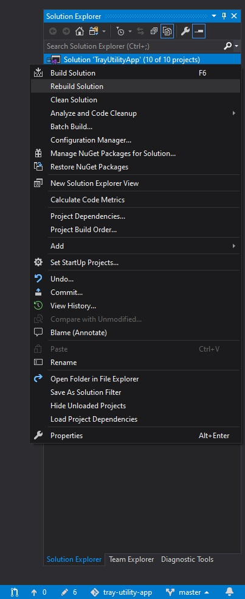

4. Open the solution folder(by default 'tray-utility-app') in your explorer, go to 'UtilitiesHandler\bin':  


5. Rename it to 'UtilitiesHandler':  


6. Move the folder to your directory where you usually keep your programs (by default 'Program Files'):  


7. Create a shortcut for 'UtilitiesHandler.exe' in your desktop or pin it to 'Taskbar' or 'Start' to be able to have a quick access:  


## Using the app

### First opening

When you start the app in your PC, the first thing you see is Ballon Tip in the right corner of your screen:  
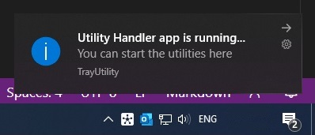

Clicking on Ballon Tip you can open the user interface of the app. Also you can open the UI clicking on the icon in the tray and selecting 'Open UI' from the context menu or just double-clicking on the icon:  


User interface of the app:  
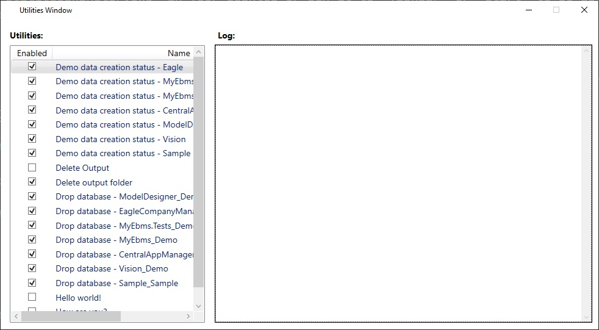

You can configure the app as you want. You can uncheck some utilities from the UI, which you don't want to use and leave other utilities, which you want to use:  


And than you don't see unchecked utilities in the context menu when you click on icon in the tray:  
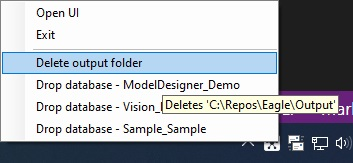

### Using built-in utilities

For example, there is an utility, which deletes specific folder. Let's use the utility:
1. Click on app icon in the tray:  


2. If you have such folder with this directory, it will be deleted. You can see the result in the UI:  
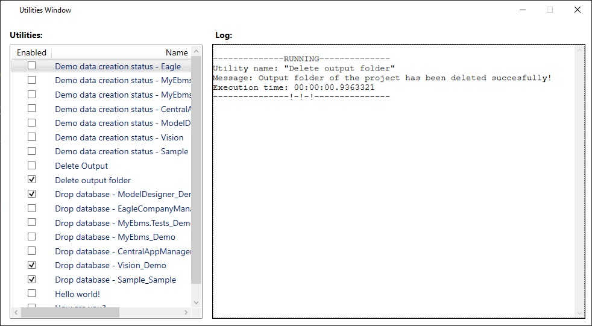

Since I had this folder, the folder was deleted.

3. Let's repeat the action again. Now I don't have the specified folder, so I get the next result in the UI:  


As we see, the second message says that there is no folder with such directory.

The app works like this. All utilities return messages as a result, so you can see the result of utilities, which you ran clicking on from the context menu.

## Contributing

This is how do look projects in the solution in Visual Studio Professional:


Only one project here has UI and it is 'UtilitiesHandler'. The app starts from this project.  
'Common' project is the base project for all the utilities through which 'UtilitiesHandler' detects utilities.

### Utility project properties
- [x] Type (usually): Class library;  
- [x] Target framework (usually): .NET Framework 4.8;  
- [x] Name (Required): starts with 'EU.' prefix and has words with meaning;  
- [x] Reference (Required): add 'Common' project from the solution;  
- [x] Output path for 'Debug' mode: ..\UtilitiesHandler\bin\Debug\ ;  
- [x] Output path for 'Release' mode: ..\UtilitiesHandler\bin\Release\ .

### Utility project class
- [x] Name (Required): same as project name without prefix;  
- [x] Namespace of class (Required): same as project name;  
- [x] Inherit (Required): abstract UtilityBase class;  
- [x] Implements (Required): 'Run' and 'Help' methods of abstract UtilityBase class, which comes from 'Common' project;  
- [x] Attribute (Required): applies 'Utility' attribute where set utility name, which will be shown in the UI of 'UtilitiesHandler' project.

Example:
```csharp
namespace EU.DeleteOutputFolder
{
    [Utility("DeleteOutputFolder")]
    public class DeleteOutputFolder : UtilityBase
    {
    }
}

```

### Utility project class methods

#### 'Run' method
- [x] Name: 'Run';  
- [x] Access modifier: Public;  
- [x] Return type: string;  
- [x] Override method;  
- [x] Parameters: no;  
- Perpose: performs actions, which user expect of utility and returns the result of actions.

Example:
```csharp
public override string Run()
{
    //some action...
    return "Succesfully done!";
}
```

#### 'Help' method
- [x] Name: 'Help'  
- [x] Access modifier: Public;  
- [x] Return type: string;  
- [x] Override method;  
- [x] Parameters: no;  
- Perpose: returns information about the utility. The information will be shown when user hover on utility name in the context menu, which opens when click on the icon in the tray.

Example:
```csharp
public override string Help()
{
    return "Information about utility";
}
```

## How to add new utilities: Step by step

### Adding
1. Open this repository in Visual Studio:  
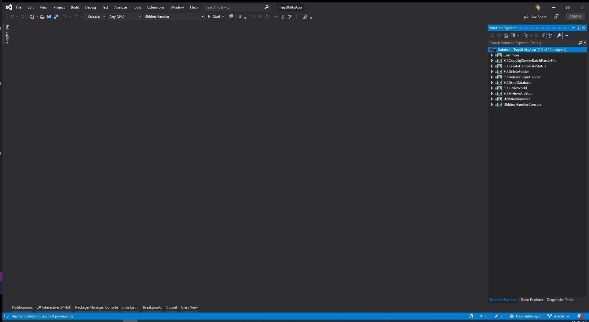

2. Right-clicking on solution name in Solution Explorer go to 'Add' and click 'New project...':  
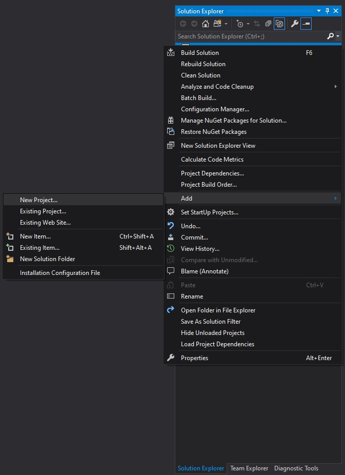

3. Select 'Class Library (.NET Framework)' and press 'Next':  


4. Set 'Project name', 'Location' and 'Framework' than press 'Create':  
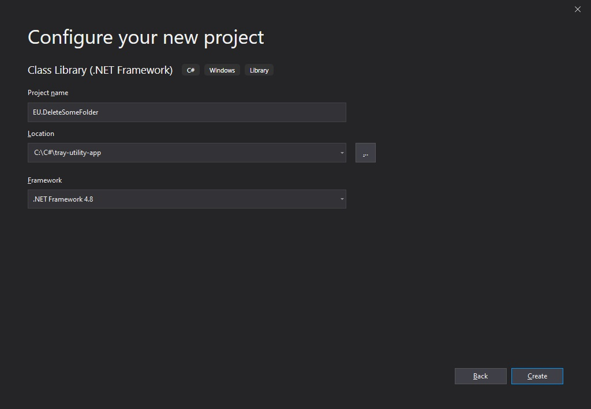

5. Rename the class to project name without prefix('DeleteSomeFolder' in this case):  
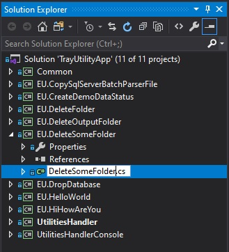

6. Right-clicking on 'Reference' and select 'Add reference...' from the context menu:  


7. Check 'Common' project in the list and press 'OK':  
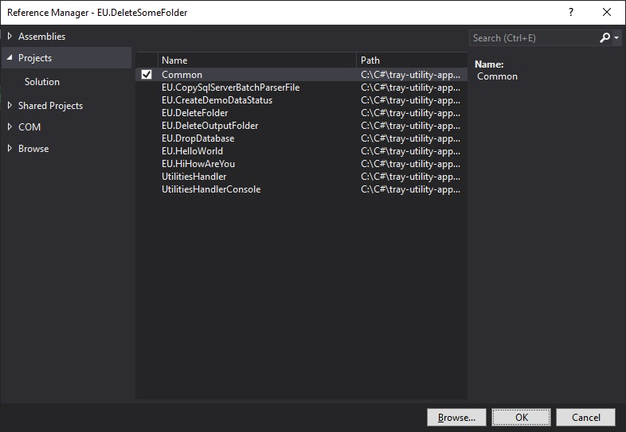

8. Right-click on project name and select 'Properties':  
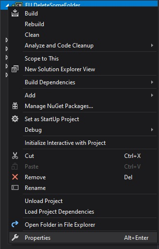

9. 'Application' tab configurations should be like the following:  
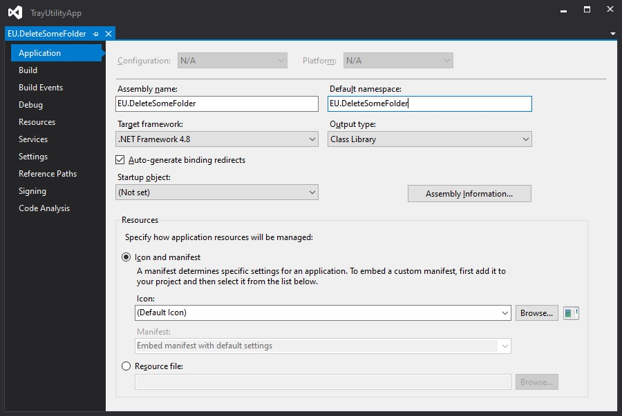

10. In 'Build' tab set 'Configuration' to 'Release' and Output path to '..\UtilitiesHandler\bin\Release\':  


11. In 'Build' tab set 'Configuration' to 'Debug' and Output path to '..\UtilitiesHandler\bin\Debug\':  
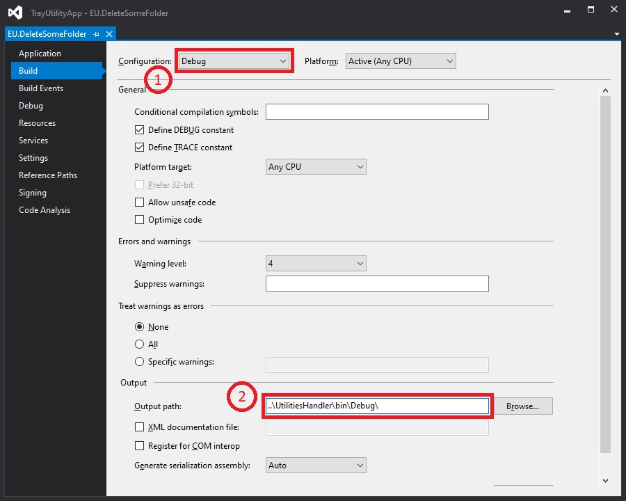

12. Change 'DeleteSomeFolder' class code to:

```csharp
using Common;
using System.IO;

namespace EU.DeleteSomeFolder
{
    [Utility(UtilityName)]
    public class DeleteSomeFolder : UtilityBase
    {
        const string UtilityName = "Delete some folder";
        const string DeletingFolderPath = @"C:\SomeFolder";
        public override string Run()
        {
            if (Directory.Exists(DeletingFolderPath))
            {
                Directory.Delete(DeletingFolderPath, true);
                return "'SomeFolder' has been deleted succesfully!";
            }
            else
                return "The directory doesn't exists or the path is not set correctly.";
        }

        public override string Help()
        {
            return $"Deletes '{DeletingFolderPath}'";
        }
    }
}
```

13. Rebuild solution:  


### Testing

1. Create 'SomeFolder' folder in 'c:\' directory using 'Windows Explorer':    
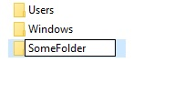

2. In Visual Studio, go to 'Standart' panel, select 'UtiliesHandler' project and start:  
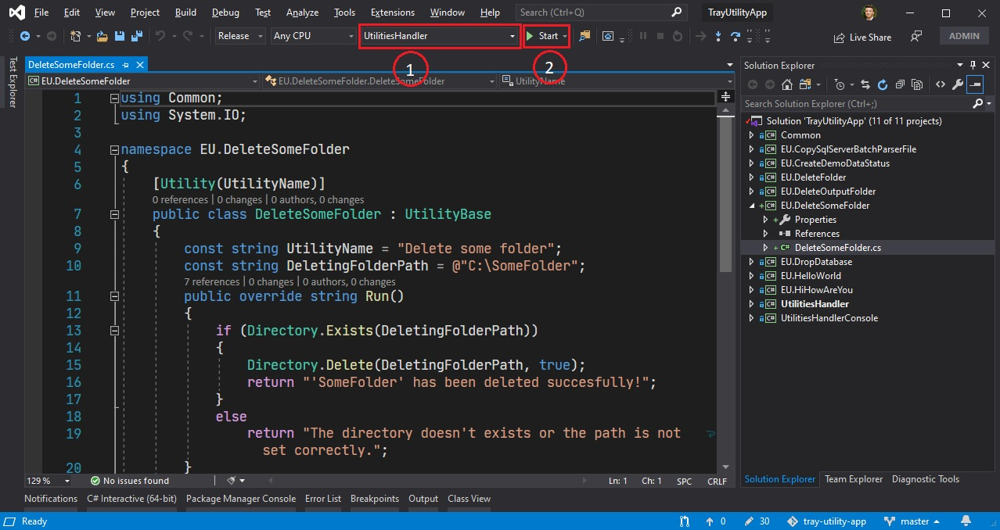

3. Click on icon in the tray:  


Hovering on 'Delete some folder' utility in the list, we have 'Deletes C:\SomeFolder' which comes from 'Help' method of utility class.

4. Clicking on the utility we deleted 'SomeFolder' in 'c:\' directory. We can check message:  
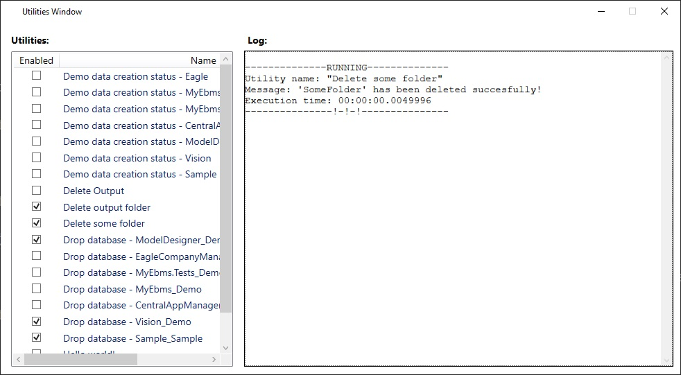

5. We can start the utility again and we have the message:  
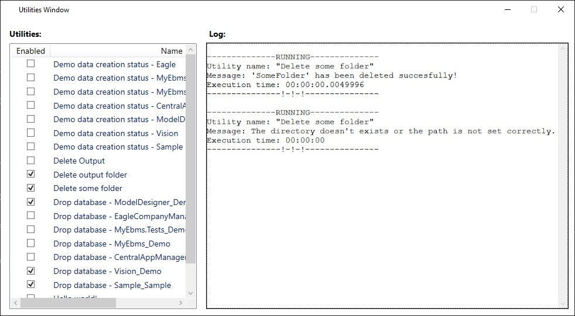

### Recommendations

In some cases you need to create utilities, which do very similiar actions.

For example delete database 'A', also you have database 'B', database 'C' and etc. You want want to create utility, which deletes for each database. In this case you can create a class and inheriting from this class, you can create utility classes and pass necessary data to parent class through the class contructor. You do this in order to save your time on creating projects for each similiar utilities.

Now you will have just one project and parent class which do all the action and children classes, which pass only data.

You can find in the solution of the repository 'EU.DropDatabase' project and it's done as aforementioned.
